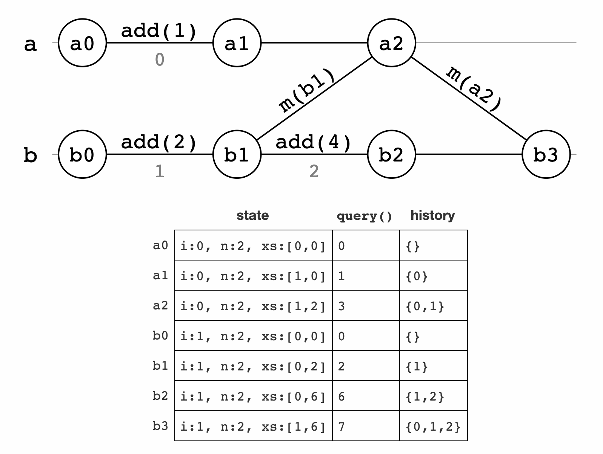

# G-Counter

A __G-Counter__ CRDT represents a replicated counter which can be added to but not subtracted from.

* The internal state of a G-Counter replicated on n machines is n-length array of non-negative integers.
* The _query_ method returns the sum of every element in the n-length array.
* The _add(x)_ update method, when invoked on the ith server, increments the ith entry of the n-length array by x. For example, server 0 will increment the 0th entry of the array, server 1 will increment the 1st entry of the array, and so on.
* The _merge_ method performs a pairwise maximum of the two arrays.

```python
class GCounter(object):
    def __init__(self, i, n):
        self.i = i # server id
        self.n = n # number of servers
        self.xs = [0] * n

    def query(self):
        return sum(self.xs)

    def add(self, x):
        assert x >= 0
        self.xs[self.i] += x

    def merge(self, c):
        zipped = zip(self.xs, c.xs)
        self.xs = [max(x, y) for (x, y) in zipped]
```

If a G-Counter object is replicated on n servers, then we construct an GCounter(0, n) object on server 0, a GCounter(1, n) object on server 1, and so on. Let's take a look at an example execution in which a G-Counter is replicated on two servers where server a is server 0 and server b is server 1.




## Requirement

* Implement state replication between CRDT G-Counters using ZeroMQ.
* The given test code will use two G-Counters to illustrate state changes from the above diagram.

## Install Dependencies

```
pipenv install -r requirements.txt
```

## To Test Your Code

```
pipenv run python main.py
```


